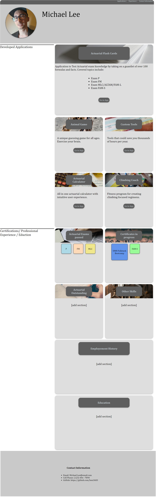

#Online Portfolio

## Description

This website is an online portfolio that contains information and links to some of my work and employment history. There is also a picture of me in the header, and contact information in the footer.

[Michael Lee Digital Portfolio Direct Link](https://leex3683.github.io/Michael_Lee_Portfolio/)

## Installation

N/A

## Usage

Clicking the links in the navigation bar at the top of the page will bring you to the referenced sections.  To access the applications, you can click the "go to app" link at the bottom of each card. Note: none of the applications have been built at this time, so the html pages linked are placeholders, only.  Below the applications, there is another section with my Certifications, Professional Experience and Eduction. This area is also under construction.

Hover over a card to see the header translate to the left and lose opacity.

This page was developed with accesibility in mind. If the window is sized down, the left asides will switch to column headings, and pictures will resize.

## Credits

N/A

## License

N/A

## Badges

N/A

## Features

N/A

## How to Contribute

N/A

## Tests

N/A